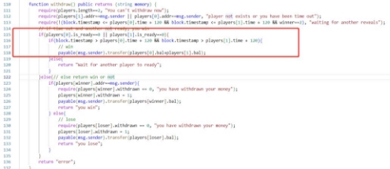

1. **General Design** 

The general flow process of my implementation is as followed: 

1) **The general process of one round of the game** 
1. Many users deposit ethers to the contract. The contract records their balance with address.** 
1. The player thinks of a number to generate the randomness.** 
1. The player calculates the hash value with fix hash function.** 
1. **Commit**: the player submits the commitment. The system intake first two players. *(c = hash(<value, nonce>))*** 
1. **Reveal**: the player submits the original value. The system verifies the the submitted value with the same hash function. *(v = <value’, nonce’>* 
   1. *verify c == hash(v))*** 
1. Generates the random number with the random seeds provided by both players. Determines who is the winner. 
1. Internally allocates the balance according to the outcome. 

viii.  Any user is able to withdraw their own balance available in the contract 

at any time **except the two on-game players**. 

2) **How is it guaranteed that a player cannot cheat?** 

Two mechanisms are used to prevent a player from cheating. 

1. **The randomness** 

To stimulate a dice roll, a random number is necessary. Cheating might occur when the generated random number can be predicted by any of player. Suppose both players are competitive, a good implementation should let both sides equally contribute to the randomness. In my implementation, the contract asks players to generate a number. As both sides are unaware of the opponent’s value. The sum of these two numbers could be consider as random.  

**Comparing to using the current block’s information**: the block information can be manipulated by the miner of the block (e.g. *block.timestamp*, *block.number,* etc).  

**Comparing to using the future block’s information**: the solidity only provides access to the hash of the most recent blocks with ***blockhash()*** function. The average block time is 15 seconds. This means that if we are trying to use the future block (let say *blockhash(block.number + 1)*) the value it return will be 0 as the block is not being mined by any miner. If we are trying to use the previous block (let say *blockhash(block.number - 1)*), as it mentioned above, other players also have access to the same value. The value still risks of being predicted.  

As a result, the formula for calculating randomness is: 

2. **The commitment scheme**:** 

The key idea of the implementation is **hiding** and **binding**.  

As it is mentioned above, the game requires both users to provide a random seed instead of block information to generate the result of dice rolling. However, the order of presenting the numbers will significantly influence the result of randomness since all the transaction data in a block is visible to all user. For example, the player who makes late decision may have learn the decision of the opponent and therefore he/she can then take advantage of the game accordingly. 

As a result, the commitment scheme is introduced. The commitment scheme takes advantage of the **collision resistance property of hash function**. Because it is impossible to calculate the original number when provided with its hash value, the decision information is hided perfectly. The contract could then verify them after gathering all the decision. This will artificially eliminate the “order” influences, because the system is able to recognize which player has changed the mind. The system will block the wrong claim. 

3) **Who pays for the reward of the winner** 

My implementation is a bit like a bet. The loser pays for the winner. According to the rule of the game. I have set the minimum stake to participate the game to 3 ETH. The contract will check the player’s balance before it proceeds to commitment. 

4) **How is the reward sent to the winner?** 

The reward will be calculated by the ***settle()*** function. The function intakes both address and the stake of one round of game. This is the only function that directly manipulate the player’s balance. The process just involves 

**internal balance movement** but not the actual balance transference between different addresses. If a player wants to get the reward, ***withdraw()*** function should be called. 

5) **Data type and structure:** 

**Storage:** 

1. **For players**: The contract maintains a list (an **address** to **value** mapping) of balance of users. This is similar to bank contract. The list is stored in **storage** and is **state variable**. The reward or penalization.** 
1. **Two players in a round**: They are represented in a **class**, also global **state variables** because the game play mechanism involves frequent state changes (whether commit or reveal the number). The states will be reset after each round of game.** 

**Memory:** 

3. **Committed value for randomness**: The contract doesn’t not record the committed values until the players-in-game forwardly reveal them. This is to prevent the decision of player can not be pre-learned.** 
3. **The gaming result** 
2. **Detail Implementation Evaluation** 
1) **Fairness** 

For the fairness issues in terms of pseudo-random, the contract recognizes three kinds of roles - The **two players** in the current game and the **miner** of the block. I also recognize the following situation that might lead to inequity. 

1. **The randomness of dice rolling** 

As it is mentioned above, the result of dice rolling is based on the random seeds provided by both players. Suppose both players are dedicated to win, which means both of the seeds they choose are random. The sum of these two seeds will also be considered as random. 

This implementation avoids the bias from the miner. If we use the block information to generate randomness, the miners might have their own inclination, which means the miners might deliberately manipulate the block data to help one of the player. 

2. **The later player refuses to reveal his number:** 

As the seed of two players are stored in storage, which means it is **visible** for all users of the block as well as the hash function. The player who should reveal in second order might have learned the result of the game ahead of being announced. The player has accessed to both his own number  and  the  opponent.  In  such  situation  he/she  might  refuse  to reveal his number to avoid losing the game. As a result, the contract will penalize the dishonest player for not revealing his number. 

The solutions are: 

1. **Identical address detection**: Before proceeding to the commitment process, the commit function will verify the address of later-join player. Players with same address are rejected. 

2. **Entrance fee**: The commitment requires 4 ETH (3 for gaming and 1 for entrance fee) minimal in the account to start the game. This aims to raise the cost of malicious user. The player has to pay 1 ETH to the contract owner before submitting a commitment hash, and the this will be refunded if the player has revealed the value. This means that the cheating player will lose 1 ETH every time. 

3. **Time out penalization**: The contract also tracks the time of the on- seat player (**Suppose that the miner is honest**). The time limit is set to be 30 second. If the on-seat player does not reveal the value, other players are able to process commitment in the place. Since reveal function is not executed, the former player is not able to get the refund. The *isTimeOut()* function keeps track of timing issues. When a timeout situation is detected, the following rules are applied to determine the outcome: 

||Player 1 |Player 2 |
| :- | - | - |
|Both reveal |According to the gaming rule |According to the gaming rule |
|Only player 1 reveal |+3 |-3 |
|Only player 2 reveal |-3 |+3 |
|Both did not reveal |0 |0 |
2) **The cost (Gas)** 

The cost needed to proceed each function are roughly as follow: 

|Function name |Gas Price (Wei) |
| - | - |
|deploy the contract |2346105 |
|deposit (1 ETH) |34187 |
|withdraw (1 ETH) |45695 |
|commit |150719 |
|**reveal (not fair)** |
85905(early reveal)/126438(late 

reveal) 
|
Generally, the cost of every player is generally fair for the first three action as there is no explicit loop in the contract. This means that every user is expect to execute same amount of code. However, the following situations should be further discussed. 

1. **If one of the players is malicious (fair)** 

If one of the players is malicious and tries to cheat at a game, for example, does not reveal his value. He/she might pay less gas as the reveal function is not executed. This is not fair for the honest player. To mitigate the loss of honest player, as it is mentioned above, the **timeout mechanism** is introduced to the system. The honest player will be treated as the winner and the punished with penalty. 

2. **If both players are dishonest in the game (fair)** 

If both players are trying to cheat in a game, which means they don’t reveal their value after committing, they will pay less gas because the reveal  function  is  not  executed.  However,  due  to  the  penalty mechanism, they will pay more than the honest players. 

3. **If both players are honest in the game (unfair)** 

This  means  that  both  players  commit  a  value  and  reveal  it honestly. In such situation, the player who reveal his number late will pay more gas than the previous one. This is because **the calculation of the  gaming  result  will  be  triggered  once  the  later  player  have revealed his/her value**. This means that the later player will execute slightly more code than the previous one (**Funding paid by last  contributor**). 

Since the Ethereum does not internally support the waiting action, which is contrary to the decentralization idea of blockchain technique, it is quite unrealistic to expect every player to pay exactly the same gas price. 

4. **The deposit and the withdraw function (fair)** 

Since  the  system  keep  tracks  of  the  balance  of  each  user independently, the amount of gas of these two processes depends on the available balance of each user. Every user is expect to execute same amount of code. So this is considered to be fair. 

**3.  Potential Hazards and Vulnerabilities (Security)** 

1) **Reentrancy** 

In the contract, the direct balance manipulation is further taken apart from the gaming process (**pull over push design**). This means that the balance status can only be affected by the gaming result (The outcome function, which is set to private). The result is only visible to both players but they have no access to it. Instead of transferring balance directly to the winner, let the player withdraw it when they want to. 

As a result, the only scenario that the reentrancy attack might occur is the 

withdraw balance function. The contract follows best practice, which will finish all state changes first, and only then transfer the balance back to user (as it is showed in the code). 

2) **Denial of Service** 
1. **Unbounded operation leads to over gas limitation** 

The contract does not rely on explicit loops. Besides, the contract also avoids  using  the  *call*  function  which  might  exceed  the  gas  limit.  The attackers should not be able to attack the contract by overflowing the gas. 

2. **Withholding gaming seats** 

**Problem description:** As the smart contract adopt commitment scheme to implement randomness, which involves interactions of both players, monopolization might occur. This means that  some dishonest players might  withhold  both  of  the  gaming  seats.  Specifically  in  my implementation, the malicious user committed a hash but do not reveal the value: 

**Solution:** This can be mitigated in three main ways (are evaluated previously). 

1. **Identical address detection** 
1. **Entrance fee** 
1. **Timeout penalization** 
3) **Griefing** 

The implementation sticks to the **pull over push** idea. Instead of sending the reward  directly  to  the  winner’s  account,  the  contract  maintains  a  list  of balance of user and allow the users to withdraw their balance. This means that once a user deposit a certain amount of ether to the contract, he/she can repeatedly join the game and accumulate the result of reward or penalty. 

4) **Front-running** 

The front-running attack might occur in the **commitment process**. Since the contract adopt FCFS (first come first serve) for the two gaming positions. For the same commitment value, the players that are willing to set higher gas price are more likely to gain the gaming seats. 

4. **Analysis of Fellow Student’s Contract** 

The fellow contract: student s2206370 

1) **DoS attack & Front-running** 

The fellow’s implementation of contract also adopts the commitment scheme. However, the code does not implement measures to prevent the DoS attack. Specifically, if a player activate the *join\_game()* function but do not forwardly call the *ready()* function: 

The contract will be stuck and others players can not proceed. The contract cannot kick out the attackers who deliberately occupy the gaming seats. This will lead to a denial-of-service situation for other players. Besides, for the same reason, the players that set high gas price are more likely to join the game. 

2) **Pull over push practice & Reentrancy** 

The contract does not strictly insist on pull over push practice. Although the withdraw function allows player to withdraw the balance, the contract does not set the balance buffer to 0 before actually transfer money back to the player’s address. This might cause the problem of reentrancy. When the transference event ends, the **state variable of player** still keeps the balance. 

5. **Transaction records** 
1) Deploy contract: 0x773a46b5d7b12abaeec3bd75f791798e15fdcc233a6f660260c405c479b0a 419 
1) Deposit (12 ETH) 0xd67bd68242bdbb3c3b82bae59fad062291d1f944af586a4c572d4c1b60c23 d87 
1) Commit: 0xfbec14020d503353db9bc02316f5bde82d16ce9aad61275f1d09a4a65d531 c1b 
1) Reveal: 0xa23beadeaa7da4f8e9e094fbebed4c148c242ed2468045cc08034d162a55c 6b0 
1) Withdraw (1 ETH): 0xd949639a362b03d2786dccc130abda36020da8c8c7c3ad4febb3d14f2ad29 fc6 

